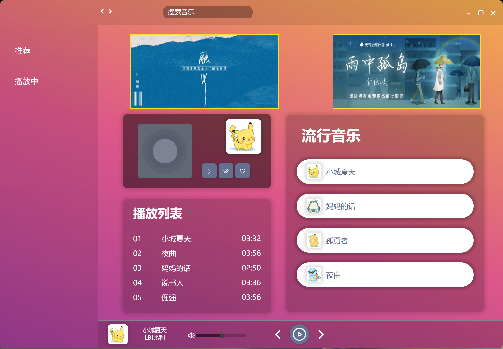
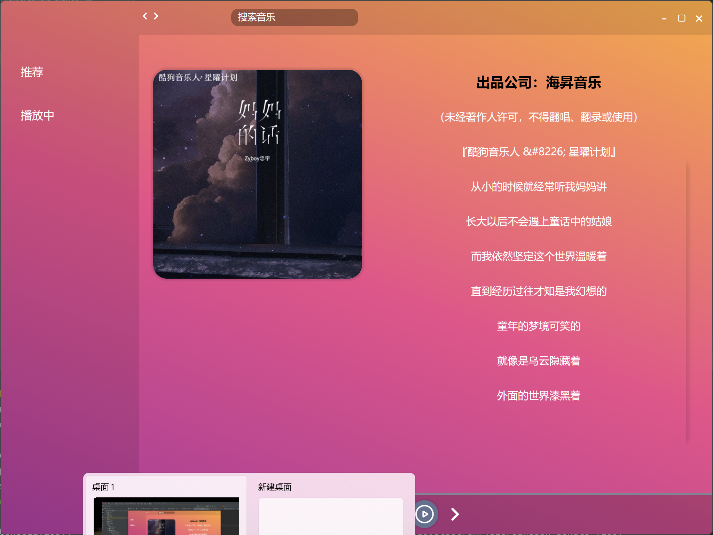

### nodeJS + express + electron + react的音乐播放器

<p align="center">
   <a href="https://reactnative.dev/docs/contributing">
    
  </a>
</p>

## 简介

该播放器使用了主流的`electron` `react` `TypeScript` 等主流技术开发。

#### 已实现功能

- [x] 路由集成 🧭
- [x] 状态管理集成（Redux）🍍
- [x] 自行封装control panel🪝
- [x] 自行封装轮播图 🖌️
- []  音乐推荐 🌹
- []  音乐搜索📦
- [x] 播放歌词滚动 🌍

#### 运行这个项目
- 前端
```shell
cnpm install
cnpm start
```
- 后端
地址：`https://github.com/Beacontownfc/music_player_backend`
```shell
cnpm install
node main.js
```


#### 运行截图

- 首页

- 播放页


#### 待完成事项
- 音乐推荐(后端实现)
- 音乐搜索(后端实现)


